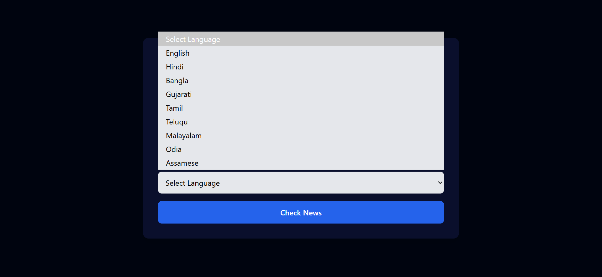

# Multilingual Fake News Detection (9 Languages)

## Overview
A full-stack machine learning web application that detects fake news across multiple languages using Natural Language Processing (NLP) and classification models. The system supports 9 languages and provides real-time predictions through a React frontend and Flask backend.

---

## Features
- Supports 9 languages (Hindi, English, Tamil, Telugu, etc.)
- Data preprocessing and cleaning using NLP techniques
- Exploratory Data Analysis (EDA)
- Machine Learning classification models
- Performance evaluation (Accuracy, Precision, Recall, F1-score)
- Interactive UI using React
- Flask REST API backend

---

## Tech Stack
Frontend: React (Vite), JavaScript, HTML, CSS  
Backend: Flask (Python), REST API  
Data & ML: Pandas, NumPy, Scikit-learn, NLTK, Matplotlib, Seaborn  

---

## Project Structure
multilingual-fake-news-detection/
│
├── backend/
│   ├── app.py
│   ├── models/              (not uploaded - large files)
│   └── vectorizers/         (not uploaded - large files)
│
├── frontend/
│   ├── public/
│   ├── src/
│   │   ├── components/
│   │   ├── App.jsx
│   │   ├── main.jsx
│   │
│   ├── package.json
│   └── vite.config.js
│
├── screenshots/
│   └── result.png
│
└── README.md

---

## How to Run the Project

### Clone Repository
git clone https://github.com/your-username/multilingual-fake-news-detection.git  
cd multilingual-fake-news-detection  

---

## Run Backend (Flask)

cd backend  

python -m venv venv  

Windows: venv\Scripts\activate  
Mac/Linux: source venv/bin/activate  

pip install flask pandas numpy scikit-learn nltk matplotlib seaborn flask-cors  

python app.py  

Backend runs at: http://127.0.0.1:5000  

---

## Run Frontend (React)

Open new terminal:

cd frontend  

npm install  

npm run dev  

Frontend runs at: http://localhost:5173  

---

## Using the Application
1. Open frontend in browser  
2. Enter news text  
3. Select language  
4. Click predict  
5. View result (Real / Fake) 

---

## Screenshots

---

## Notes
- Dataset and trained model files are not included due to size limitations  
- Ensure backend is running before frontend  
- CORS enabled for communication  

---

## Future Improvements
- Deploy full-stack app online  
- Add language auto-detection  
- Improve model accuracy  
- Add authentication  

---

## Author
Avni Vashist
